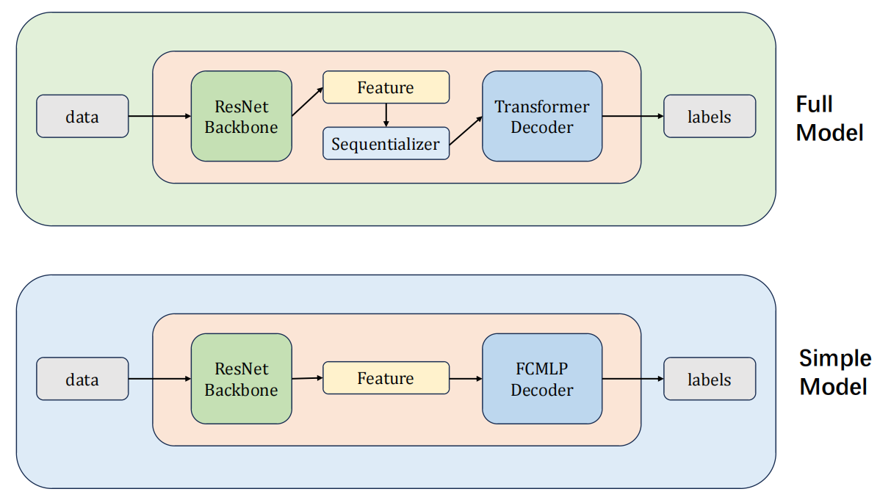
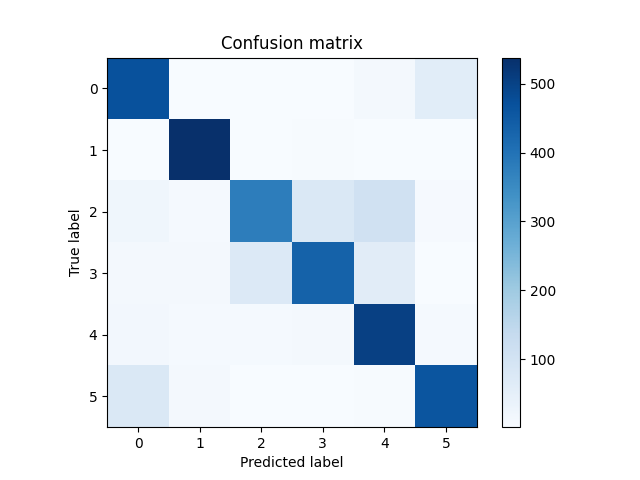
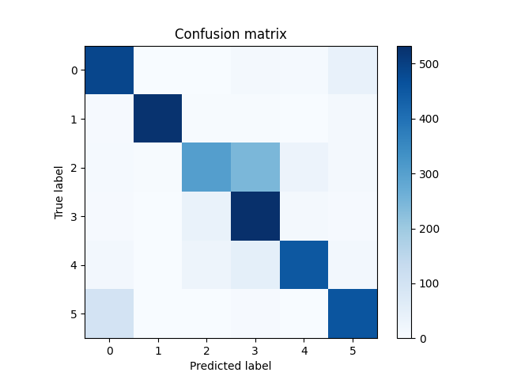
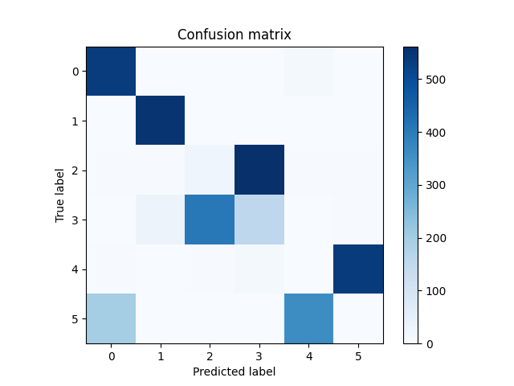
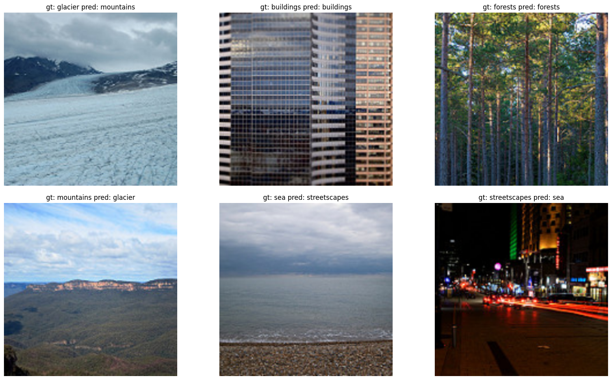

# AI Image Classifiers

## Requirements

Run 

```bash
pip install -r requirements.txt
```

to install the required packages.

## Run

```bash
bash train_xxx.sh # remember to change the config and path
bash test_xxx.sh
```

## Pipeline



## 2. Main Results

|Metric| Accuracy | F1 | Precision | Recall |
|---|---|---|---|---|
|Full Model|$\bf 0.8580 \uparrow$|$\bf 0.8572 \uparrow$|$\bf 0.8612  \uparrow $|$\bf 0.8618  \uparrow$|
|Simple Model| $0.7839$ | $0.7826$ | $0.7971$ | $0.7879$ |
|CLIP Model | $0.3698$ | $0.3454$ | $0.3203$ | $0.3784$ |

### 2.1. Transformer Decoder + Adam + Bigger Feature

See ``config/config_transformer.json`` for the configuration.

- Confusion Matrix

  


### 2.2. FC Decoder + Adamx + Smaller Feature

See ``config/config_fc.json`` for the configuration.

- Confusion Matrix

  


### 2.3. CLIP Model

**For the results please check the [visual.ipynb](./visual.ipynb) for visualization results and clip model outputs.**


- Confusion Matrix

  

## 3. Ablation for Full Model

Drop one class to see the affects on the model's performance.


|Drop Class| Accuracy | F1 | Precision | Recall |
|---|---|---|---|---|
|0(buildings)   | $0.7814 \downarrow$ | $0.7803 \downarrow$ | $0.7977 \downarrow$ | $0.7813 \downarrow$ |
|1(forests)     | $0.8235 \downarrow$ | $0.8232 \downarrow$ | $0.8331 \downarrow$ | $0.8226 \downarrow$ |
|2(glacier)     | $0.8851 \uparrow$ | $0.8792 \uparrow$ | $0.8869 \uparrow$ | $0.8833 \uparrow$ |
|3(mountains)   | $0.8998 \uparrow$ | $0.8996 \uparrow$ | $0.9004 \uparrow$ | $0.9005 \uparrow$ |
|4(sea)         | $0.8751 \uparrow$ | $0.8749 \uparrow$ | $0.8775 \uparrow$ | $0.8760 \uparrow$ |
|5(streetscape) | $0.8872 \uparrow$ | $0.8872 \uparrow$ | $0.8912 \uparrow$ | $0.8918 \uparrow$ |


And after seeing the result of the photo below, we can get some intuition for explaining the results. These photos' predicted labels are predicted by clip model.



And by looking at the confusion matrix, we get the same results:

*4(sea) and 5(streetscape), 2(glacier) and 3(moutain) are confused pair and the model tends to predict 5(streetscape) as 0(buildings)*

These results are probably due to the balance of training set and that the streetscape indeed contains many buildings.

This inspires us that the key of model's performance is whether the samples of one class is confused with another and the ratio of the samples of each class.

- The reason for this performance might be that 0 is always assumed when the model judges a street scenes or somewhat, that makes the buildings' accuracy high, and remove buildings will make the total performance drop. 

- The reasom for "forest" is that the model can easily distinguish the forest from the other classes, and remove forest will make the total performance drop.

- The reason for "glacier" and "moutain" is that the two class are confused with each other, and remove one of them will make the total performance increase.

- The reason for "sea" is similarly, because "sea" test photos are very confusing.

- And the reason for "streetscape" is that the model might always see the streetscape as the other classes like "buildings" or "sea", and remove streetscape will make the total performance increase.

- Also, the performance's increase or decrease level are similar, which can indicate that the samples of each class are approximately balanced.